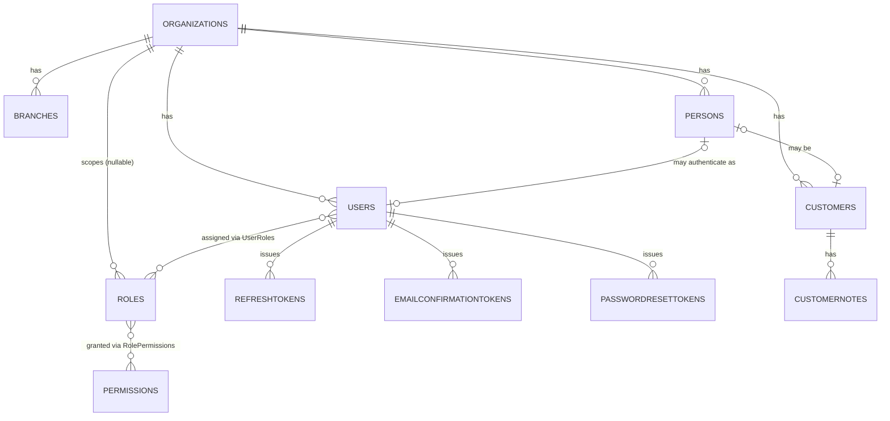

# Nexa — Database Architecture (Phase 1: Foundation)

Multi-tenant SaaS platform. Strategy: **Shared Database + Shared Schema + `OrganizationId`** tenant discriminator on every business table. SQL Server, accessed via Dapper + stored procedures, Clean Architecture.

Scope of this document: Tenant Management, Identity & Authentication, Authorization (RBAC), Customer Management (CRM foundation), Audit. Billing, Notification, and Education are named as future schemas but not modeled yet.

---

## 1. Architecture Overview

- **Isolation model**: every tenant-scoped row carries `OrganizationId UNIQUEIDENTIFIER NOT NULL`, enforced in two layers:
  1. **Application layer** — every Dapper repository/stored procedure requires `@OrganizationId` and filters on it. No query is allowed to omit it for tenant-scoped tables.
  2. **Database layer (defense in depth)** — SQL Server **Row-Level Security (RLS)** policies keyed on `SESSION_CONTEXT('OrganizationId')`, so a bug or ad-hoc query can't leak cross-tenant rows even if the app layer forgets a filter.
- **Person vs. User**: `Person` is a human record (PII, no credentials). `User` is a login/credential record that optionally points to a `Person`. This lets non-human or pre-provisioned accounts exist, and lets a `Customer` exist without ever having system access.
- **Naming**: schema-generic entities (`Customer`, `Service` — Service arrives with Phase 2/CRM extension — `Payment` later in `billing`). No `Student`, `Course`, `TuitionPayment` etc. in core schemas; those live only in the future `education` schema as thin extensions that reference `crm.Customers`.
- **IDs**: `UNIQUEIDENTIFIER` (sequential, via `NEWSEQUENTIALID()`) for entities referenced across module boundaries or exposed via API (non-guessable, mergeable across environments). `BIGINT IDENTITY` for high-volume, append-only, never-externally-referenced tables (`SignInLogs`, `AuditLogs`, tokens) — better clustered-index insert performance than random/sequential GUID churn at that volume.
- **Password storage**: a single `PasswordHash` column using a modern self-salting KDF (ASP.NET Core Identity's `PasswordHasher` — PBKDF2-HMAC-SHA256, or Argon2id/BCrypt if swapped in). No separate `PasswordSalt` column — the salt is embedded in the hash string by these algorithms; a standalone salt column is a legacy pattern and adds nothing.
- **Tokens** (refresh, email confirmation, password reset): store only `TokenHash` (SHA-256 of the token), never the raw token — the DB is not the place a leaked token stays useful.

---

## 2. Schema Organization

| Schema | Responsibility | Phase |
|---|---|---|
| `tenant` | Organizations, Branches | 1 |
| `identity` | Person, User, Roles, Permissions, tokens, sign-in logs | 1 |
| `crm` | Customers, CustomerNotes | 1 |
| `audit` | AuditLogs | 1 |
| `billing` | Subscriptions, Invoices, Payments | future |
| `notification` | Templates, delivery history | future |
| `education` | Courses, Classes, Enrollments, Attendance | future |

---

## 3. Common Column Conventions

Applied to every table unless noted:

```sql
CreatedAt   DATETIME2(3)      NOT NULL DEFAULT SYSUTCDATETIME()
CreatedBy   UNIQUEIDENTIFIER  NULL          -- FK -> identity.Users.Id (nullable: system/seed inserts)
UpdatedAt   DATETIME2(3)      NULL
UpdatedBy   UNIQUEIDENTIFIER  NULL
IsDeleted   BIT               NOT NULL DEFAULT 0     -- soft delete
DeletedAt   DATETIME2(3)      NULL
DeletedBy   UNIQUEIDENTIFIER  NULL
RowVersion  ROWVERSION        NOT NULL               -- optimistic concurrency
```

All timestamps are UTC. Soft delete is enforced via a filtered mechanism at the query layer (repositories always add `AND IsDeleted = 0` unless explicitly asking for deleted rows) — for reference/lookup tables (`Permissions`) soft delete is omitted since they're a static seeded catalog.

---

## 4. Tenant Management (`tenant` schema)

### `tenant.Organizations`

Represents a tenant.

```sql
CREATE TABLE tenant.Organizations (
    Id                      UNIQUEIDENTIFIER NOT NULL DEFAULT NEWSEQUENTIALID(),
    Name                    NVARCHAR(200)     NOT NULL,
    LegalName               NVARCHAR(200)     NULL,
    Slug                    NVARCHAR(100)     NOT NULL,   -- URL/subdomain-safe identifier
    LogoUrl                 NVARCHAR(500)     NULL,
    Email                   NVARCHAR(256)     NULL,
    Phone                   NVARCHAR(30)      NULL,
    Address                 NVARCHAR(500)     NULL,
    Status                  TINYINT           NOT NULL DEFAULT 0,  -- 0=Trial,1=Active,2=Suspended,3=Cancelled
    SubscriptionPlanCode    NVARCHAR(50)      NULL,       -- placeholder until `billing` schema exists
    TrialEndsAt             DATETIME2(3)      NULL,
    CreatedAt               DATETIME2(3)      NOT NULL DEFAULT SYSUTCDATETIME(),
    CreatedBy               UNIQUEIDENTIFIER  NULL,
    UpdatedAt                DATETIME2(3)      NULL,
    UpdatedBy               UNIQUEIDENTIFIER  NULL,
    IsDeleted               BIT               NOT NULL DEFAULT 0,
    DeletedAt                DATETIME2(3)      NULL,
    DeletedBy               UNIQUEIDENTIFIER  NULL,
    RowVersion               ROWVERSION        NOT NULL,
    CONSTRAINT PK_Organizations PRIMARY KEY NONCLUSTERED (Id)
);
CREATE UNIQUE CLUSTERED INDEX CIX_Organizations_CreatedAt ON tenant.Organizations (CreatedAt, Id);
CREATE UNIQUE INDEX UX_Organizations_Slug ON tenant.Organizations (Slug) WHERE IsDeleted = 0;
CREATE INDEX IX_Organizations_Status ON tenant.Organizations (Status) WHERE IsDeleted = 0;
```

*Note on clustering*: for the one table that isn't itself tenant-scoped, clustering by `(CreatedAt, Id)` instead of by `Id` avoids page-split churn from sequential-but-not-monotonic GUID inserts while keeping a nonclustered unique PK for lookups. This pattern is optional for V1 (row counts will be tiny — thousands, not millions) but stated here as the intended pattern for every other high-insert table.

### `tenant.Branches`

```sql
CREATE TABLE tenant.Branches (
    Id              UNIQUEIDENTIFIER NOT NULL DEFAULT NEWSEQUENTIALID(),
    OrganizationId  UNIQUEIDENTIFIER NOT NULL,
    Name            NVARCHAR(200)    NOT NULL,
    Code            NVARCHAR(50)     NULL,
    Address         NVARCHAR(500)    NULL,
    Phone           NVARCHAR(30)     NULL,
    Email           NVARCHAR(256)    NULL,
    IsMainBranch    BIT              NOT NULL DEFAULT 0,
    Status          TINYINT          NOT NULL DEFAULT 1,  -- 1=Active,0=Inactive
    CreatedAt       DATETIME2(3)     NOT NULL DEFAULT SYSUTCDATETIME(),
    CreatedBy       UNIQUEIDENTIFIER NULL,
    UpdatedAt       DATETIME2(3)     NULL,
    UpdatedBy       UNIQUEIDENTIFIER NULL,
    IsDeleted       BIT              NOT NULL DEFAULT 0,
    DeletedAt       DATETIME2(3)     NULL,
    DeletedBy       UNIQUEIDENTIFIER NULL,
    RowVersion      ROWVERSION       NOT NULL,
    CONSTRAINT PK_Branches PRIMARY KEY (Id),
    CONSTRAINT FK_Branches_Organizations FOREIGN KEY (OrganizationId)
        REFERENCES tenant.Organizations (Id)
);
CREATE INDEX IX_Branches_OrganizationId ON tenant.Branches (OrganizationId) WHERE IsDeleted = 0;
CREATE UNIQUE INDEX UX_Branches_Org_Code ON tenant.Branches (OrganizationId, Code)
    WHERE Code IS NOT NULL AND IsDeleted = 0;
```

Every V1 organization gets exactly one `Branches` row created alongside it (`IsMainBranch = 1`), so multi-branch is additive later, not a migration.

---

## 5. Identity (`identity` schema)

### `identity.Persons`

Pure human data, no credentials.

```sql
CREATE TABLE identity.Persons (
    Id              UNIQUEIDENTIFIER NOT NULL DEFAULT NEWSEQUENTIALID(),
    OrganizationId  UNIQUEIDENTIFIER NOT NULL,
    FirstName       NVARCHAR(100)    NOT NULL,
    LastName        NVARCHAR(100)    NOT NULL,
    FullName        AS (LTRIM(RTRIM(FirstName + ' ' + LastName)))  PERSISTED,
    Email           NVARCHAR(256)    NULL,
    Phone           NVARCHAR(30)     NULL,
    DateOfBirth     DATE             NULL,
    Gender          TINYINT          NULL,
    ProfileImageUrl NVARCHAR(500)    NULL,
    CreatedAt       DATETIME2(3)     NOT NULL DEFAULT SYSUTCDATETIME(),
    CreatedBy       UNIQUEIDENTIFIER NULL,
    UpdatedAt       DATETIME2(3)     NULL,
    UpdatedBy       UNIQUEIDENTIFIER NULL,
    IsDeleted       BIT              NOT NULL DEFAULT 0,
    DeletedAt       DATETIME2(3)     NULL,
    DeletedBy       UNIQUEIDENTIFIER NULL,
    RowVersion      ROWVERSION       NOT NULL,
    CONSTRAINT PK_Persons PRIMARY KEY (Id),
    CONSTRAINT FK_Persons_Organizations FOREIGN KEY (OrganizationId)
        REFERENCES tenant.Organizations (Id)
);
CREATE INDEX IX_Persons_OrganizationId ON identity.Persons (OrganizationId) WHERE IsDeleted = 0;
CREATE INDEX IX_Persons_Org_Email ON identity.Persons (OrganizationId, Email) WHERE IsDeleted = 0;
```

Persons are scoped to one organization (not shared platform-wide) — if the same human works with two tenants, they get two `Person` rows. This avoids cross-tenant PII linkage and keeps the isolation story simple; a platform-wide "identity graph" is out of scope for a business-management SaaS.

### `identity.Users`

Authentication account. Optionally linked to a `Person`.

```sql
CREATE TABLE identity.Users (
    Id                  UNIQUEIDENTIFIER NOT NULL DEFAULT NEWSEQUENTIALID(),
    OrganizationId      UNIQUEIDENTIFIER NOT NULL,
    PersonId            UNIQUEIDENTIFIER NULL,
    Username            NVARCHAR(100)    NOT NULL,
    Email               NVARCHAR(256)    NOT NULL,
    NormalizedEmail     AS (UPPER(Email)) PERSISTED,
    PasswordHash        NVARCHAR(500)    NOT NULL,   -- self-salting KDF output; see §1
    SecurityStamp       NVARCHAR(100)    NOT NULL DEFAULT CONVERT(NVARCHAR(100), NEWID()),
    ConcurrencyStamp    NVARCHAR(100)    NOT NULL DEFAULT CONVERT(NVARCHAR(100), NEWID()),
    IsEmailConfirmed    BIT              NOT NULL DEFAULT 0,
    IsActive            BIT              NOT NULL DEFAULT 1,
    LastLoginAt         DATETIME2(3)     NULL,
    LastLoginIp         NVARCHAR(45)     NULL,
    FailedLoginAttempts INT              NOT NULL DEFAULT 0,
    LockoutEndDate      DATETIME2(3)     NULL,
    CreatedAt           DATETIME2(3)     NOT NULL DEFAULT SYSUTCDATETIME(),
    CreatedBy           UNIQUEIDENTIFIER NULL,
    UpdatedAt           DATETIME2(3)     NULL,
    UpdatedBy           UNIQUEIDENTIFIER NULL,
    IsDeleted           BIT              NOT NULL DEFAULT 0,
    DeletedAt           DATETIME2(3)     NULL,
    DeletedBy           UNIQUEIDENTIFIER NULL,
    RowVersion          ROWVERSION       NOT NULL,
    CONSTRAINT PK_Users PRIMARY KEY (Id),
    CONSTRAINT FK_Users_Organizations FOREIGN KEY (OrganizationId)
        REFERENCES tenant.Organizations (Id),
    CONSTRAINT FK_Users_Persons FOREIGN KEY (PersonId)
        REFERENCES identity.Persons (Id)
);
CREATE INDEX IX_Users_OrganizationId ON identity.Users (OrganizationId) WHERE IsDeleted = 0;
CREATE UNIQUE INDEX UX_Users_Org_NormalizedEmail ON identity.Users (OrganizationId, NormalizedEmail) WHERE IsDeleted = 0;
CREATE UNIQUE INDEX UX_Users_Org_Username ON identity.Users (OrganizationId, Username) WHERE IsDeleted = 0;
CREATE INDEX IX_Users_LockoutEndDate ON identity.Users (LockoutEndDate) WHERE LockoutEndDate IS NOT NULL;
```

Uniqueness is **scoped per organization**, not global — the same email can hold separate accounts at two different tenants (a teacher who works at two institutes). Login flow therefore always resolves `OrganizationId` first (by subdomain/slug or an org picker), then looks up `(OrganizationId, NormalizedEmail)`. If a future "one global login across all your organizations" experience is wanted, that's an additive `identity.GlobalAccounts` table, not a rework of this one.

`SecurityStamp` changes on password change / role change, invalidating any long-lived JWTs still claiming the old permission set.

### `identity.Roles`

```sql
CREATE TABLE identity.Roles (
    Id              UNIQUEIDENTIFIER NOT NULL DEFAULT NEWSEQUENTIALID(),
    OrganizationId  UNIQUEIDENTIFIER NULL,      -- NULL = system role template, shared across all tenants
    Name            NVARCHAR(100)    NOT NULL,
    Description     NVARCHAR(500)    NULL,
    IsSystemRole    BIT              NOT NULL DEFAULT 0,
    CreatedAt       DATETIME2(3)     NOT NULL DEFAULT SYSUTCDATETIME(),
    CreatedBy       UNIQUEIDENTIFIER NULL,
    UpdatedAt       DATETIME2(3)     NULL,
    UpdatedBy       UNIQUEIDENTIFIER NULL,
    IsDeleted       BIT              NOT NULL DEFAULT 0,
    CONSTRAINT PK_Roles PRIMARY KEY (Id),
    CONSTRAINT FK_Roles_Organizations FOREIGN KEY (OrganizationId)
        REFERENCES tenant.Organizations (Id)
);
CREATE INDEX IX_Roles_OrganizationId ON identity.Roles (OrganizationId) WHERE IsDeleted = 0;
CREATE UNIQUE INDEX UX_Roles_System_Name ON identity.Roles (Name) WHERE OrganizationId IS NULL AND IsDeleted = 0;
CREATE UNIQUE INDEX UX_Roles_Org_Name ON identity.Roles (OrganizationId, Name) WHERE OrganizationId IS NOT NULL AND IsDeleted = 0;
```

`Owner`, `Admin`, `Accountant`, `Teacher` ship as **system role templates** (`OrganizationId IS NULL`, `IsSystemRole = 1`) seeded once. A tenant can additionally define custom roles scoped to itself. `UserRoles` can reference either.

### `identity.Permissions`

Static, seed-controlled catalog — `INT IDENTITY`, not a GUID, since it's a fixed code list referenced by constants in application code.

```sql
CREATE TABLE identity.Permissions (
    Id          INT IDENTITY(1,1) NOT NULL,
    Code        NVARCHAR(150)     NOT NULL,   -- e.g. 'Customer.View'
    Name        NVARCHAR(200)     NOT NULL,
    Description NVARCHAR(500)     NULL,
    Module      NVARCHAR(100)     NULL,       -- grouping for UI, e.g. 'Customer', 'Payment'
    CreatedAt   DATETIME2(3)      NOT NULL DEFAULT SYSUTCDATETIME(),
    CONSTRAINT PK_Permissions PRIMARY KEY (Id)
);
CREATE UNIQUE INDEX UX_Permissions_Code ON identity.Permissions (Code);
```

### `identity.RolePermissions`

```sql
CREATE TABLE identity.RolePermissions (
    RoleId       UNIQUEIDENTIFIER NOT NULL,
    PermissionId INT              NOT NULL,
    CreatedAt    DATETIME2(3)     NOT NULL DEFAULT SYSUTCDATETIME(),
    CONSTRAINT PK_RolePermissions PRIMARY KEY (RoleId, PermissionId),
    CONSTRAINT FK_RolePermissions_Roles FOREIGN KEY (RoleId) REFERENCES identity.Roles (Id),
    CONSTRAINT FK_RolePermissions_Permissions FOREIGN KEY (PermissionId) REFERENCES identity.Permissions (Id)
);
CREATE INDEX IX_RolePermissions_PermissionId ON identity.RolePermissions (PermissionId);
```

### `identity.UserRoles`

```sql
CREATE TABLE identity.UserRoles (
    UserId          UNIQUEIDENTIFIER NOT NULL,
    RoleId          UNIQUEIDENTIFIER NOT NULL,
    OrganizationId  UNIQUEIDENTIFIER NOT NULL,   -- denormalized for cheap tenant-scoped filtering/index
    AssignedAt      DATETIME2(3)     NOT NULL DEFAULT SYSUTCDATETIME(),
    AssignedBy      UNIQUEIDENTIFIER NULL,
    CONSTRAINT PK_UserRoles PRIMARY KEY (UserId, RoleId),
    CONSTRAINT FK_UserRoles_Users FOREIGN KEY (UserId) REFERENCES identity.Users (Id),
    CONSTRAINT FK_UserRoles_Roles FOREIGN KEY (RoleId) REFERENCES identity.Roles (Id)
);
CREATE INDEX IX_UserRoles_RoleId ON identity.UserRoles (RoleId);
CREATE INDEX IX_UserRoles_OrganizationId ON identity.UserRoles (OrganizationId);
```

A user's effective permission set = `UNION` of every `Permission` reachable through every `Role` in `UserRoles` for that user — computed once at login and embedded as claims in the JWT, refreshed on token refresh.

### Authentication security tables

```sql
CREATE TABLE identity.RefreshTokens (
    Id                   BIGINT IDENTITY(1,1) NOT NULL,
    UserId               UNIQUEIDENTIFIER NOT NULL,
    OrganizationId       UNIQUEIDENTIFIER NOT NULL,   -- denormalized, avoids join on every refresh
    TokenHash            CHAR(64)         NOT NULL,   -- SHA-256 hex digest; raw token never stored
    ExpiresAt            DATETIME2(3)     NOT NULL,
    CreatedAt            DATETIME2(3)     NOT NULL DEFAULT SYSUTCDATETIME(),
    CreatedByIp          NVARCHAR(45)     NULL,
    RevokedAt            DATETIME2(3)     NULL,
    RevokedBy            UNIQUEIDENTIFIER NULL,
    RevokedByIp          NVARCHAR(45)     NULL,
    ReplacedByTokenHash  CHAR(64)         NULL,
    CONSTRAINT PK_RefreshTokens PRIMARY KEY (Id),
    CONSTRAINT FK_RefreshTokens_Users FOREIGN KEY (UserId) REFERENCES identity.Users (Id)
);
CREATE UNIQUE INDEX UX_RefreshTokens_TokenHash ON identity.RefreshTokens (TokenHash);
CREATE INDEX IX_RefreshTokens_UserId ON identity.RefreshTokens (UserId);
CREATE INDEX IX_RefreshTokens_ExpiresAt ON identity.RefreshTokens (ExpiresAt);  -- cleanup job

CREATE TABLE identity.EmailConfirmationTokens (
    Id         BIGINT IDENTITY(1,1) NOT NULL,
    UserId     UNIQUEIDENTIFIER NOT NULL,
    TokenHash  CHAR(64)         NOT NULL,
    ExpiresAt  DATETIME2(3)     NOT NULL,
    UsedAt     DATETIME2(3)     NULL,
    CreatedAt  DATETIME2(3)     NOT NULL DEFAULT SYSUTCDATETIME(),
    CONSTRAINT PK_EmailConfirmationTokens PRIMARY KEY (Id),
    CONSTRAINT FK_EmailConfirmationTokens_Users FOREIGN KEY (UserId) REFERENCES identity.Users (Id)
);
CREATE UNIQUE INDEX UX_EmailConfirmationTokens_TokenHash ON identity.EmailConfirmationTokens (TokenHash);
CREATE INDEX IX_EmailConfirmationTokens_UserId ON identity.EmailConfirmationTokens (UserId);

CREATE TABLE identity.PasswordResetTokens (
    Id               BIGINT IDENTITY(1,1) NOT NULL,
    UserId           UNIQUEIDENTIFIER NOT NULL,
    TokenHash        CHAR(64)         NOT NULL,
    ExpiresAt        DATETIME2(3)     NOT NULL,
    UsedAt           DATETIME2(3)     NULL,
    RequestedByIp    NVARCHAR(45)     NULL,
    CreatedAt        DATETIME2(3)     NOT NULL DEFAULT SYSUTCDATETIME(),
    CONSTRAINT PK_PasswordResetTokens PRIMARY KEY (Id),
    CONSTRAINT FK_PasswordResetTokens_Users FOREIGN KEY (UserId) REFERENCES identity.Users (Id)
);
CREATE UNIQUE INDEX UX_PasswordResetTokens_TokenHash ON identity.PasswordResetTokens (TokenHash);
CREATE INDEX IX_PasswordResetTokens_UserId ON identity.PasswordResetTokens (UserId);

CREATE TABLE identity.SignInLogs (
    Id              BIGINT IDENTITY(1,1) NOT NULL,
    OrganizationId  UNIQUEIDENTIFIER NULL,     -- unknown until org/email resolved
    UserId          UNIQUEIDENTIFIER NULL,     -- null for failed attempts against unknown accounts
    EmailAttempted  NVARCHAR(256)    NOT NULL,
    IsSuccessful    BIT              NOT NULL,
    FailureReason   NVARCHAR(200)    NULL,
    IpAddress       NVARCHAR(45)     NULL,
    UserAgent       NVARCHAR(500)    NULL,
    CreatedAt       DATETIME2(3)     NOT NULL DEFAULT SYSUTCDATETIME(),
    CONSTRAINT PK_SignInLogs PRIMARY KEY (Id)
);
CREATE INDEX IX_SignInLogs_UserId_CreatedAt ON identity.SignInLogs (UserId, CreatedAt DESC);
CREATE INDEX IX_SignInLogs_Email_CreatedAt ON identity.SignInLogs (EmailAttempted, CreatedAt DESC);
CREATE INDEX IX_SignInLogs_Ip_CreatedAt ON identity.SignInLogs (IpAddress, CreatedAt DESC);
```

`RefreshTokens` implements **rotation with reuse detection**: each refresh issues a new token and sets `ReplacedByTokenHash` on the old one instead of deleting it. If a hashed token that's already `RevokedAt IS NOT NULL` is ever presented again, that's a signal of theft — revoke the entire token family (`UserId`) and force re-authentication.

No FK from `SignInLogs`/`AuditLogs` to `Organizations`/`Users` — a hard FK on a high-volume append-only log would block org/user deletion and add lock contention; tenant/user linkage there is informational, not referentially enforced.

---

## 6. CRM Foundation (`crm` schema)

### `crm.Customers`

```sql
CREATE TABLE crm.Customers (
    Id              UNIQUEIDENTIFIER NOT NULL DEFAULT NEWSEQUENTIALID(),
    OrganizationId  UNIQUEIDENTIFIER NOT NULL,
    PersonId        UNIQUEIDENTIFIER NULL,      -- optional: a Customer may be a company, not a person
    CustomerCode    NVARCHAR(50)     NULL,       -- human-friendly reference number
    CustomerType    NVARCHAR(50)     NOT NULL,   -- e.g. 'Student' (education), 'Patient' (clinic) — free text, vertical-defined
    DisplayName     NVARCHAR(200)    NOT NULL,   -- denormalized from Person, or company name
    Status          TINYINT          NOT NULL DEFAULT 1,  -- 1=Active,0=Inactive,2=Archived
    Source          NVARCHAR(100)    NULL,
    CreatedAt       DATETIME2(3)     NOT NULL DEFAULT SYSUTCDATETIME(),
    CreatedBy       UNIQUEIDENTIFIER NULL,
    UpdatedAt       DATETIME2(3)     NULL,
    UpdatedBy       UNIQUEIDENTIFIER NULL,
    IsDeleted       BIT              NOT NULL DEFAULT 0,
    DeletedAt       DATETIME2(3)     NULL,
    DeletedBy       UNIQUEIDENTIFIER NULL,
    RowVersion      ROWVERSION       NOT NULL,
    CONSTRAINT PK_Customers PRIMARY KEY (Id),
    CONSTRAINT FK_Customers_Organizations FOREIGN KEY (OrganizationId) REFERENCES tenant.Organizations (Id),
    CONSTRAINT FK_Customers_Persons FOREIGN KEY (PersonId) REFERENCES identity.Persons (Id)
);
CREATE INDEX IX_Customers_Org_Status ON crm.Customers (OrganizationId, Status) WHERE IsDeleted = 0;
CREATE INDEX IX_Customers_Org_PersonId ON crm.Customers (OrganizationId, PersonId) WHERE IsDeleted = 0;
CREATE UNIQUE INDEX UX_Customers_Org_Code ON crm.Customers (OrganizationId, CustomerCode)
    WHERE CustomerCode IS NOT NULL AND IsDeleted = 0;
```

`CustomerType` is a plain string in Phase 1 (education passes `"Student"`, future clinic vertical passes `"Patient"`) rather than a lookup table — it's a display/filter label, not a driver of relational integrity yet. If it grows business rules of its own, promote it to `crm.CustomerTypes` later; not needed for V1.

### `crm.CustomerNotes`

```sql
CREATE TABLE crm.CustomerNotes (
    Id              BIGINT IDENTITY(1,1) NOT NULL,
    OrganizationId  UNIQUEIDENTIFIER NOT NULL,
    CustomerId      UNIQUEIDENTIFIER NOT NULL,
    Note            NVARCHAR(MAX)    NOT NULL,
    CreatedBy       UNIQUEIDENTIFIER NOT NULL,
    CreatedAt       DATETIME2(3)     NOT NULL DEFAULT SYSUTCDATETIME(),
    IsDeleted       BIT              NOT NULL DEFAULT 0,
    CONSTRAINT PK_CustomerNotes PRIMARY KEY (Id),
    CONSTRAINT FK_CustomerNotes_Customers FOREIGN KEY (CustomerId) REFERENCES crm.Customers (Id),
    CONSTRAINT FK_CustomerNotes_Users FOREIGN KEY (CreatedBy) REFERENCES identity.Users (Id)
);
CREATE INDEX IX_CustomerNotes_Org_Customer_CreatedAt ON crm.CustomerNotes (OrganizationId, CustomerId, CreatedAt DESC)
    WHERE IsDeleted = 0;
```

---

## 7. Audit (`audit` schema)

```sql
CREATE TABLE audit.AuditLogs (
    Id             BIGINT IDENTITY(1,1) NOT NULL,
    OrganizationId UNIQUEIDENTIFIER NULL,      -- null for platform-level actions
    UserId         UNIQUEIDENTIFIER NULL,
    Action         NVARCHAR(100)    NOT NULL,  -- 'Created' | 'Updated' | 'Deleted' | 'LoginFailed' ...
    EntityName     NVARCHAR(150)    NOT NULL,  -- e.g. 'crm.Customers'
    EntityId       NVARCHAR(100)    NOT NULL,  -- string form: supports GUID and BIGINT entity ids
    OldValuesJson  NVARCHAR(MAX)    NULL,
    NewValuesJson  NVARCHAR(MAX)    NULL,
    IpAddress      NVARCHAR(45)     NULL,
    CreatedAt      DATETIME2(3)     NOT NULL DEFAULT SYSUTCDATETIME(),
    CONSTRAINT PK_AuditLogs PRIMARY KEY (Id)
);
CREATE INDEX IX_AuditLogs_Org_CreatedAt ON audit.AuditLogs (OrganizationId, CreatedAt DESC);
CREATE INDEX IX_AuditLogs_Entity ON audit.AuditLogs (EntityName, EntityId);
CREATE INDEX IX_AuditLogs_User_CreatedAt ON audit.AuditLogs (UserId, CreatedAt DESC);
```

No FKs (see rationale under §5 tokens/logs). Written by application code around every mutating stored procedure, not by triggers — triggers hide the write path and complicate the Dapper/stored-procedure story; an explicit `audit.LogAction` proc call at the end of each mutating proc is easier to reason about and test.

At scale, partition by month on `CreatedAt` and archive/cold-store logs older than the compliance retention window (12–24 months is typical); not needed for V1 volumes but the table shape already supports adding partitioning without a schema change.

---

## 8. Entity Relationships

```
tenant.Organizations 1───* tenant.Branches
tenant.Organizations 1───* identity.Persons
tenant.Organizations 1───* identity.Users
tenant.Organizations 1───* identity.Roles (tenant-scoped roles only; system roles have OrganizationId = NULL)
tenant.Organizations 1───* crm.Customers

identity.Persons     1───0..1 identity.Users      (a Person may or may not have login access)
identity.Persons     1───0..1 crm.Customers       (a Customer may or may not be backed by a Person)

identity.Users        *───* identity.Roles         via identity.UserRoles
identity.Roles         *───* identity.Permissions   via identity.RolePermissions

identity.Users        1───* identity.RefreshTokens
identity.Users        1───* identity.EmailConfirmationTokens
identity.Users        1───* identity.PasswordResetTokens
identity.Users        1───* identity.SignInLogs   (informational FK only, not enforced)

crm.Customers         1───* crm.CustomerNotes
```

### ERD (Mermaid)



---

## 9. Index Recommendations (summary)

- Every tenant-scoped table: nonclustered index leading with `OrganizationId` (filtered `WHERE IsDeleted = 0` where soft delete applies) — this is the index that backs every list/search query in the app.
- Every FK column gets a supporting index unless it's already the leading column of another index (SQL Server does not auto-index FKs).
- Login-path lookups (`Users.NormalizedEmail`, `Users.Username`) are unique filtered indexes scoped by `OrganizationId`.
- Token tables: unique index on `TokenHash` (point lookup on every authenticated request) plus an index on the expiry column for the cleanup job.
- Log/audit tables: composite `(key, CreatedAt DESC)` indexes matching the "recent activity for X" access pattern; avoid indexing free-text columns (`Note`, `OldValuesJson`).
- Avoid over-indexing write-heavy tables (`SignInLogs`, `RefreshTokens`, `AuditLogs`) — every index adds write cost on the highest-volume tables in the system.

---

## 10. Multi-Tenant Security Recommendations

1. **App-layer enforcement**: every repository method and stored procedure that touches a tenant-scoped table takes `@OrganizationId` as a required parameter and includes it in the `WHERE` clause — never rely on a `CustomerId`/`UserId` alone being "obviously" tenant-safe.
2. **Row-Level Security as a second line of defense**: define a security predicate function and policy per tenant-scoped schema, filtering on `SESSION_CONTEXT('OrganizationId')`, which the API layer sets via `sp_set_session_context` at the start of each request/connection. This means even a hand-written ad-hoc query or a future ORM bypass can't return cross-tenant rows.
3. **JWT claims carry `OrganizationId`** and it is validated against the resource being accessed on every request (belt-and-suspenders with #1/#2).
4. **Credential storage**: `PasswordHasher` (PBKDF2/Argon2id), never reversible encryption; `SecurityStamp` invalidates issued tokens on password/role change.
5. **Token hygiene**: refresh-token rotation with reuse detection (§5); short-lived access tokens (5–15 min); tokens stored hashed, compared by hash.
6. **Account lockout**: `FailedLoginAttempts` + `LockoutEndDate` on `Users`, combined with IP/email-based rate limiting fed by `SignInLogs` for brute-force detection.
7. **Least privilege DB principals**: the application's SQL login executes only via stored procedures (`EXECUTE` grant), no direct table `SELECT/INSERT/UPDATE/DELETE` grants — limits blast radius of SQL injection or a compromised connection string.
8. **Encryption at rest**: Transparent Data Encryption (TDE) on the database; consider column-level encryption (Always Encrypted) for highly sensitive fields if/when payment data lands in `billing`.
9. **No cross-tenant identifiers leak in errors**: 404, not 403, when a resource exists but belongs to another tenant — don't confirm existence.
10. **Auditability**: every mutation on identity/authorization/customer data writes an `audit.AuditLogs` row with before/after JSON, enabling "who changed what" reconstruction without needing full temporal tables in V1.

---

## 11. Future Extensibility

- **`billing` schema**: `SubscriptionPlans`, `Invoices`, `Payments`, `Installments` — hangs off `tenant.Organizations` and, on the receivables side, `crm.Customers`. The `SubscriptionPlanCode` placeholder on `Organizations` becomes a real FK once this schema exists.
- **`notification` schema**: `NotificationTemplates`, `NotificationHistory` — references `crm.Customers`/`identity.Users` as recipients; no changes needed to Phase 1 tables.
- **`education` schema**: `Courses` (a `Service` concept), `Classes`, `Enrollments` (links `crm.Customers` to `Courses`/`Classes`), `Attendance`, teacher assignment (links `identity.Users` with a `Teacher` role to `Classes`). None of this requires touching `identity`, `tenant`, `crm`, or `audit` — the generic-naming rule in §1 is what buys this.
- **`Service` as a generic concept**: not modeled in Phase 1 since only Education needs it right now, but the intended home is a new `crm.Services` (or a dedicated `catalog` schema) table shaped like `Customers`, with `education.Courses` becoming a 1:1 extension row the same way `Customers` extend `Persons`.
- **Row-count growth**: `SignInLogs` and `AuditLogs` are the tables likeliest to need partitioning/archival first; both are already designed with `BIGINT IDENTITY` PKs and no inbound FKs, so partitioning or moving them to a separate database later is a data-movement problem, not a schema redesign.
