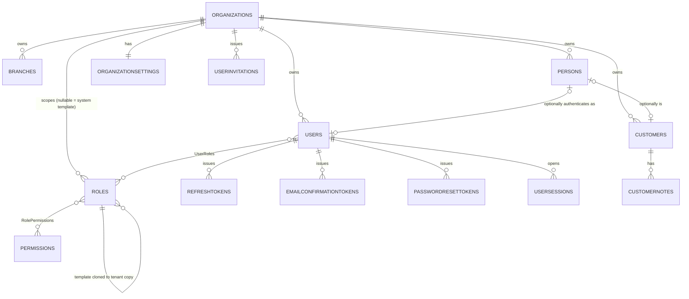

# Nexa — Final Database Blueprint (Phase 1: Foundation)

This finalizes the conceptual design in [DATABASE_ARCHITECTURE.md](DATABASE_ARCHITECTURE.md) into a production-ready blueprint. Runnable DDL lives in [`Database/Migrations/`](../../Database/Migrations) (`001`–`009`) and is the source of truth; this document explains the *why* behind it.

> **Migration 009 note**: `009_Harden_MultiTenant_Identity.sql` closed several gaps left open by `001`–`008` — it adds `dbo.SchemaVersions` (applied-migration tracking), validates existing data for cross-tenant leakage before tightening constraints, replaces several single-column foreign keys with **composite tenant-safe foreign keys** (`(OrganizationId, X) → Parent(OrganizationId, Id)`), materializes tenant-local role copies from the global role templates, and adds `tenant.OrganizationSettings`, `identity.UserSessions`, and `identity.UserInvitations`. Every section below reflects the post-009 state.

---

## 1. Database Architecture Summary

- **Strategy**: Shared Database + Shared Schema + `OrganizationId` tenant discriminator, enforced at the application layer (every query/proc requires it) and reinforced at the database layer (Row-Level Security — see §7).
- **Schemas**: `tenant`, `identity`, `crm`, `audit` are built now; `billing`, `notification`, `education` are created empty in migration 001 so future modules never need a "create schema" migration of their own — only "create tables in an existing schema."
- **Access pattern**: ASP.NET Core 10 → Dapper → SQL Server **stored procedures only** (no ad-hoc SQL from the app), Clean Architecture keeping persistence concerns out of `Domain`/`Application`.
- **Core naming rule carried through everything below**: no vertical-specific nouns (`Student`, `Course`, `TuitionPayment`) in `tenant`/`identity`/`crm`/`audit`/`billing`. Vertical nouns only ever appear in vertical schemas (`education`, and later `clinic`/`beauty` if those become dedicated schemas rather than just `CustomerType` values).

---

## 2. Final ERD Explanation

### Tenant schema

```
Organizations 1 ──── * Branches
```
One organization has one or more branches. **Required** relationship (`Branches.OrganizationId NOT NULL`) — a branch cannot exist outside an organization. **Ownership**: `Organizations` owns `Branches`; deleting an organization (soft-delete only, see §7) cascades logically to its branches at the application layer.

### Identity schema

```
Organizations 1 ──── * Persons
Organizations 1 ──── * Users
Organizations 1 ──── * Roles              (tenant-local role rows; system templates have OrganizationId = NULL)
Organizations 1 ──── 0..1 OrganizationSettings
Organizations 1 ──── * UserInvitations
Persons       1 ──── 0..1 Users           (a Person has at most one active User per tenant)
Roles (template) 1 ──── * Roles (tenant copy)   via Roles.TemplateRoleId (self-referencing)
Users         * ──── * Roles              via UserRoles (must reference tenant-local Roles only)
Roles         * ──── * Permissions        via RolePermissions
Users         1 ──── * RefreshTokens
Users         1 ──── * EmailConfirmationTokens
Users         1 ──── * PasswordResetTokens
Users         1 ──── * UserSessions
Users         1 ──── * SignInLogs         (informational only, not FK-enforced)
```

- **Organization → Persons/Users**: one-to-many, required. Every person and every login belongs to exactly one tenant (§4 of the architecture doc explains why identity is not shared across tenants).
- **Person → User**: optional one-to-one, **now DB-enforced**. A `Person` (e.g., a `Customer` contact) need not have system access; a `User` need not be linked to a `Person` at all (a service/API account) — hence `Users.PersonId` stays nullable — but `UX_Users_OrganizationId_PersonId` (added in migration 009) guarantees a given `Person` backs at most one active `User` within its tenant, closing a gap the original design left implicit.
- **User ↔ Role**: many-to-many. A user can hold several roles (e.g., `Owner` + `Teacher`) via the `UserRoles` junction.
- **Role ↔ Permission**: many-to-many via `RolePermissions`.
- **Role ownership — revised model**: a **system template** (`OrganizationId IS NULL`, `TemplateRoleId IS NULL`) is never assigned to a user directly. Migration 009 materializes a **tenant-local copy** of every system template (`Owner`, `Admin`, `Accountant`, `Teacher`) for each organization — a real `Roles` row with `OrganizationId` set and `TemplateRoleId` pointing back at the template it was cloned from, carrying its own copy of the template's `RolePermissions`. `UserRoles` must reference one of these tenant-local rows (`CK`-equivalent enforced via THROW-validated backfill + the composite FK below), never the template itself. This lets a tenant customize its own `Owner` role's permissions later without mutating (or being coupled to) the shared template, while still tracing back to "which template did this start as."
- **User → tokens/sessions/logs**: one-to-many. `RefreshTokens`, `EmailConfirmationTokens`, `PasswordResetTokens`, and `UserSessions` all carry a **composite tenant-safe FK** `(OrganizationId, UserId) → Users(OrganizationId, Id)` rather than a plain `UserId → Users(Id)` FK — this makes it structurally impossible to attach a token/session row to a user whose `OrganizationId` doesn't match the row's own `OrganizationId` (see §4 and §7). `SignInLogs` deliberately keeps **no FK** — a failed login against a non-existent account must still be logged.
- **Organization ↔ OrganizationSettings**: one-to-zero-or-one, `OrganizationId` is both the PK and the FK on `OrganizationSettings` (true 1:1 extension table, not a separate entity with its own identity).
- **Organization → UserInvitations**: one-to-many. An invitation targets an email address plus a tenant-local `RoleId` and is issued `InvitedBy` a tenant user — both `RoleId` and `InvitedBy` use the same composite tenant-safe FK pattern.

### CRM schema

```
Organizations 1 ──── * Customers
Persons       1 ──── 0..1 Customers   (a Customer may or may not be backed by a Person)
Customers     1 ──── * CustomerNotes
```

- **Organization → Customers**: one-to-many, required.
- **Person → Customer**: optional. Most customers in the education vertical are backed by a `Person` (the student themself), but the model also allows a `Customer` that represents an organization/company (`PersonId NULL`, `DisplayName` carries the company name) — needed for future B2B billing scenarios without a redesign.
- **Customer → CustomerNotes**: one-to-many, required. A note cannot exist without a customer.

### Audit schema

```
(Organizations) 0..1 ──── * AuditLogs   (informational only, not FK-enforced)
(Users)         0..1 ──── * AuditLogs   (informational only, not FK-enforced)
```

`AuditLogs` references `OrganizationId`/`UserId`/`EntityId` by value, not by foreign key, so it can log actions against entities and actors that may since have been hard-deleted, and so the highest-write-volume table in the system carries zero FK-check overhead.

### Mermaid ERD



---

## 3. Table Naming Conventions

### Schema naming rules

Lowercase, singular, bounded-context nouns: `tenant`, `identity`, `crm`, `billing`, `audit`, `notification`, `education`.

**Why**: a schema is the natural grant boundary in SQL Server (`GRANT SELECT ON SCHEMA::crm TO ReportingRole`) and the natural module boundary in Clean Architecture — one schema per bounded context keeps `education`'s eventual tables from ever needing to touch `identity`'s internals directly, and keeps object names short (`crm.Customers`, not `dbo.CrmCustomers`).

### Table naming rules

**Plural**, PascalCase: `Organizations`, `Users`, `Customers`, `RolePermissions`.

**Why plural**: a table is a collection of rows of that entity — `Users` reads as "the set of all users," matching how it's queried (`SELECT * FROM identity.Users`). This is the dominant enterprise SQL Server convention and was already applied consistently in the Phase 1 DDL — changing to singular now would be a breaking rename across every script and every generated Dapper query. Junction tables follow the same rule, named as the concatenation of the two plural entities in FK-order (`RolePermissions`, not `RolesPermissions` or `Role_Permission`).

### Column naming rules

| Purpose | Convention | Example |
|---|---|---|
| Primary key | `Id` | `Id` |
| Foreign key | `<ReferencedEntitySingular>Id` | `OrganizationId`, `UserId`, `CustomerId` |
| Timestamps | `<Verb>At`, UTC, `DATETIME2(3)` | `CreatedAt`, `UpdatedAt`, `ExpiresAt`, `RevokedAt` |
| Actor of a timestamp | `<Verb>By` | `CreatedBy`, `UpdatedBy`, `RevokedBy` |
| Booleans | `Is<Adjective>` | `IsActive`, `IsDeleted`, `IsSystemRole`, `IsMainBranch` |
| Enums/status | `Status` as `TINYINT` + `CHECK` constraint, not a string | `Status TINYINT CHECK (Status BETWEEN 0 AND 3)` |
| Codes/human identifiers | `<Entity>Code` | `CustomerCode` |

**Why `TINYINT` + `CHECK` over `NVARCHAR` for status**: 1 byte vs. up to hundreds, indexable and comparable without collation concerns, and the `CHECK` constraint catches invalid values at the database boundary regardless of which application layer wrote the row. The mapping (`0 = Trial`, etc.) lives in a shared `Shared` project enum, documented next to each table above.

### Index naming conventions

- Non-unique: `IX_<Table>_<Column1>[_<Column2>...]` — e.g. `IX_Customers_OrganizationId_Status`.
- Unique: `UX_<Table>_<Column1>[_<Column2>...]` — e.g. `UX_Users_OrganizationId_NormalizedEmail`.
- Filtered indexes keep the same name pattern; the filter predicate is documented in the DDL comment, not the name (names would get unwieldy).

### Constraint naming conventions

| Constraint | Pattern | Example |
|---|---|---|
| Primary key | `PK_<Table>` | `PK_Users` |
| Foreign key | `FK_<Table>_<ReferencedTable>` | `FK_Users_Organizations` |
| Composite tenant-safe foreign key | `FK_<Table>_<ReferencedTable>_Tenant` | `FK_Users_Persons_Tenant`, `FK_UserRoles_Roles_Tenant` — a two-column FK `(OrganizationId, <Fk>Id) → Parent(OrganizationId, Id)`, added by migration 009 (see §4) wherever a row references another tenant-scoped row |
| Unique (as a constraint, not index) | `UQ_<Table>_<Column>` | not used here — uniqueness is implemented via filtered `UX_` indexes instead (needed because soft-delete requires `WHERE IsDeleted = 0`, which a plain `UNIQUE` constraint can't express) |
| Check | `CK_<Table>_<Column>` | `CK_Organizations_Status` |
| Default | `DF_<Table>_<Column>` | `DF_Users_IsActive` |

---

## 4. SQL Server DDL Scripts

Full CREATE SCHEMA / CREATE TABLE / constraints / indexes are in [`Database/Migrations/001_CreateSchemas.sql`](../../Database/Migrations/001_CreateSchemas.sql) through [`008_Seed_GlobalData.sql`](../../Database/Migrations/008_Seed_GlobalData.sql) — those files are the executable artifact; this section explains the data-type choices made throughout them.

| Choice | Used for | Rationale |
|---|---|---|
| `UNIQUEIDENTIFIER` (via `NEWSEQUENTIALID()`) | Any entity referenced across module/schema boundaries or exposed via API: `Organizations`, `Branches`, `Persons`, `Users`, `Roles`, `Customers` | Non-guessable (can't enumerate `/customers/1`, `/customers/2`), mergeable across environments/future read-replicas without collision, and `NEWSEQUENTIALID()` avoids the random-GUID page-split penalty by keeping inserts roughly ordered. |
| `BIGINT IDENTITY` | High-volume, append-only, never cross-referenced-by-clients tables: `RefreshTokens`, `EmailConfirmationTokens`, `PasswordResetTokens`, `SignInLogs`, `AuditLogs`, `CustomerNotes` | 8 bytes vs. 16, monotonically increasing (ideal clustered-index insert pattern for tables that will see the highest write throughput in the system), and these rows are never linked to from another schema so global uniqueness/unguessability doesn't matter. |
| `INT IDENTITY` | `Permissions` only | A small, static, seed-controlled catalog referenced by application-code constants (`Permissions.CustomerView`) — a 4-byte sequential key is simplest and permissions are never created at runtime by tenants. |
| `DATETIME2(3)` | Every timestamp | Higher precision and range than `DATETIME`, same storage cost class, ANSI-standard. Precision `(3)` (milliseconds) is enough for audit/ordering purposes and avoids the 100ns-precision storage overhead `DATETIME2(7)` doesn't buy anything here. |
| `NVARCHAR` (never `VARCHAR`) | Every text column | Institute names, person names, and notes will include Arabic and other non-Latin scripts (the initial market is Jordan) — `VARCHAR` would silently corrupt that data under most collations. |
| `TINYINT` | `Status` columns | See §3. |
| `BIT` | Booleans | Native SQL Server boolean type, 1 bit storage (rounded up to nearest byte per row). |
| `ROWVERSION` | Every table subject to concurrent updates from the UI | Automatic optimistic-concurrency token; Dapper compares it on `UPDATE ... WHERE RowVersion = @RowVersion` to detect lost updates without an extra round trip. |

### Audit columns — which tables get them

Full audit block (`CreatedAt/CreatedBy/UpdatedAt/UpdatedBy/IsDeleted/DeletedAt/DeletedBy/RowVersion`) is applied to every **entity table that represents a business object a user creates/edits through the UI**: `Organizations`, `Branches`, `Persons`, `Users`, `Customers`, `OrganizationSettings` (minus soft delete, per above). `Roles` picked up `DeletedAt`/`DeletedBy` in migration 009 (still no `RowVersion` — roles are edited rarely enough that optimistic-concurrency conflicts aren't a real risk), all now backed by a `CK_Roles_SoftDelete` consistency check. **Log/event tables** (`SignInLogs`, `AuditLogs`, `RefreshTokens`, `EmailConfirmationTokens`, `PasswordResetTokens`, `UserSessions`, `UserInvitations`) get `CreatedAt` (+`CreatedBy`/`RevokedBy`/`InvitedBy` where there's a genuine actor) plus a lifecycle `CHECK` constraint (`ExpiresAt > CreatedAt`, mutual exclusivity of e.g. `UsedAt`/`RevokedAt`) rather than the generic `IsDeleted` pattern — they're immutable-once-written, so a full soft-delete block would be dead weight; their "closed" state is expressed by `UsedAt`/`RevokedAt`/`AcceptedAt` instead. **`CustomerNotes` is the one exception that changed**: migration 009 added `DeletedAt`/`DeletedBy` (with `CK_CustomerNotes_SoftDelete`) alongside its existing `IsDeleted`, upgrading it from "flag only" to full soft-delete-with-actor — notes turned out to need "who deleted this and when" for the same accountability reasons `Customers` does. `Permissions` gets only `CreatedAt` — it's a seeded catalog, not a user-editable entity.

### Multi-tenant rule enforcement in DDL

Every table above `Organizations` itself carries `OrganizationId UNIQUEIDENTIFIER NOT NULL` with an `FK_..._Organizations` foreign key, **except** the four tables where tenant ownership is intentionally indirect:
- `Permissions` — global catalog, no tenant.
- `Roles` — `OrganizationId` is **nullable** by design (system templates vs. tenant-local copies); see §2.
- `SignInLogs`, `AuditLogs` — `OrganizationId` present but **not FK-enforced**, for the append-only/never-blocks-deletes reason in §7.

**Composite tenant-safe foreign keys (added in migration 009).** Every child-to-parent reference where both tables are tenant-scoped now uses a two-column FK against a matching two-column unique index on the parent, instead of a plain `Id → Id` FK:

```sql
-- Parent side (example): a filtered/composite unique index that includes OrganizationId
CREATE UNIQUE INDEX UX_Users_OrganizationId_Id ON identity.Users (OrganizationId, Id);

-- Child side: the FK can now only be satisfied by a parent row with the SAME OrganizationId
ALTER TABLE identity.UserRoles
    ADD CONSTRAINT FK_UserRoles_Users_Tenant
        FOREIGN KEY (OrganizationId, UserId) REFERENCES identity.Users (OrganizationId, Id);
```

This upgrades tenant isolation from "the app always filters by `OrganizationId`, and the two IDs happen to usually agree" to **the database physically cannot store a cross-tenant reference** — inserting a `UserRoles` row with `OrganizationId = TenantA` but `UserId` belonging to `TenantB` now fails the FK check, full stop, independent of any application code or RLS policy. Applied to: `identity.Users → Persons`, `identity.UserRoles → Users` / `→ Roles` / `→ AssignedBy(Users)`, `identity.RefreshTokens → Users`, `identity.EmailConfirmationTokens → Users`, `identity.PasswordResetTokens → Users`, `identity.UserSessions → Users` (both `UserId` and `RevokedBy`), `identity.UserInvitations → Roles` / `→ InvitedBy(Users)`, `crm.Customers → Persons`, `crm.CustomerNotes → Customers` / `→ CreatedBy(Users)` / `→ DeletedBy(Users)`. See §7 for how this fits into the overall isolation model.

`RolePermissions` doesn't carry `OrganizationId` (it joins two rows — `Roles`/`Permissions` — that are already tenant-consistent by construction: a tenant-local role's permissions are cloned only from its own template). `UserRoles.OrganizationId` remains stored denormalized so the tenant-scoped index (`IX_UserRoles_OrganizationId`) exists without a join, but it's now also load-bearing as one half of two composite FKs rather than purely a query-optimization column.

### New foundation tables added by migration 009

- **`tenant.OrganizationSettings`** — a true 1:1 extension of `Organizations` (`OrganizationId` is both PK and FK). Carries `TimeZoneId`, `DefaultLanguageCode`, `CurrencyCode`, `DateFormat`, `ReceiptPrefix`, and an open-ended `AdditionalSettingsJson NVARCHAR(MAX)` column guarded by `CHECK (ISJSON(AdditionalSettingsJson) = 1)` for anything that doesn't yet warrant its own column. This replaces the "deferred, not V1" placeholder the original blueprint noted for organization settings — it shipped sooner than planned, and every existing organization was backfilled a default row as part of the migration. Audit columns: `CreatedAt/CreatedBy/UpdatedAt/UpdatedBy/RowVersion` (no soft delete — settings live and die with their organization).
- **`identity.UserSessions`** — one row per authenticated session/device (`DeviceId`, `DeviceName`, `UserAgent`, `IpAddress`, `LastSeenAt`, `ExpiresAt`, `RevokedAt`/`RevokedBy`/`RevocationReason`), tenant-safe FK to `Users`. Backs the "log out everywhere" / "see your active devices" capability the original blueprint's Security Review described narratively (§7) but didn't yet model as a table. `RefreshTokens.SessionId` links a refresh token to the session that issued it.
- **`identity.UserInvitations`** — email-invite flow: `Email`/`NormalizedEmail` (computed, trimmed+uppercased), a tenant-local `RoleId` the invitee will receive on acceptance, `TokenHash` (SHA-256, same "never store the raw token" rule as every other token table), `InvitedBy`, and an `AcceptedAt`/`RevokedAt` lifecycle guarded by a `CHECK` that forbids a row being both accepted and revoked. This is the "add a teammate" counterpart to the owner-only self-registration flow in §5 — see the updated Tenant Creation Flow.

---

## 5. Migration Strategy

### Migration order

| # | File | Contents | Depends on |
|---|---|---|---|
| 001 | `001_CreateSchemas.sql` | All 7 schemas (`tenant`, `identity`, `crm`, `audit`, `billing`, `notification`, `education`) | — |
| 002 | `002_Tenant_Organizations_Branches.sql` | `tenant.Organizations`, `tenant.Branches` | 001 |
| 003 | `003_Identity_Persons_Users.sql` | `identity.Persons`, `identity.Users` | 002 |
| 004 | `004_Identity_Roles_Permissions.sql` | `identity.Roles`, `Permissions`, `RolePermissions`, `UserRoles` | 003 |
| 005 | `005_Identity_Tokens_SignInLogs.sql` | `RefreshTokens`, `EmailConfirmationTokens`, `PasswordResetTokens`, `SignInLogs` | 003 |
| 006 | `006_Crm_Customers_CustomerNotes.sql` | `crm.Customers`, `crm.CustomerNotes` | 002, 003 |
| 007 | `007_Audit_AuditLogs.sql` | `audit.AuditLogs` | 001 (no hard FKs) |
| 008 | `008_Seed_GlobalData.sql` | Global `Permissions` catalog + system `Roles` (idempotent `MERGE`) | 004 |
| 009 | `009_Harden_MultiTenant_Identity.sql` | `dbo.SchemaVersions`; pre-flight cross-tenant data validation; composite tenant-safe FKs across `identity`/`crm`; `Organizations`/`Branches`/`Persons`/`Users`/`Roles`/`Customers`/`CustomerNotes` lifecycle `CHECK` constraints; `tenant.OrganizationSettings`; role-template materialization into per-tenant `Roles` rows; `identity.UserSessions`, `identity.UserInvitations`; token-table tenant isolation (`OrganizationId` added to `EmailConfirmationTokens`/`PasswordResetTokens`) and reuse-detection columns (`TokenFamilyId`, `ReplacedByTokenId`) on `RefreshTokens`; `SignInLogs`/`AuditLogs` enrichment (`EventType`, `CorrelationId`, JSON-validity checks, covering indexes) | 001–008, and the target database's *existing data* (the migration validates it first — see below) |

`billing`, `notification`, `education` schemas exist from migration 001 onward but stay empty until their respective phases — this means Phase 2 work adds `010_Education_Courses.sql` etc. without ever touching this file set.

Scripts are numbered and applied in order, and as of migration 009 that order is **self-tracked**: `dbo.SchemaVersions` records each applied `MigrationId`, and 009 itself checks that table first and no-ops (`COMMIT; RETURN;`) if `009` is already recorded — so it's safe to re-run against an environment that already has it applied. `001`–`008` don't yet have this guard; adopting `dbo.SchemaVersions` as the single source of truth for "what's applied where" going forward (rather than a separate DbUp/journal table) is the natural next step, since 009 already created it.

**009 runs inside one transaction with `SET XACT_ABORT ON`** and a `TRY/CATCH` that rolls back and re-throws on any failure — unlike 001–008, which are additive `CREATE`-only scripts safe to run individually, 009 alters live tables (dropping and re-adding FKs, changing computed columns, tightening nullability) against a database that may already hold production data, so it fails closed rather than leaving the schema half-migrated. Section 1 of the script (`Validate existing data before tenant-hardening`) is a deliberate pre-flight: it checks for cross-tenant `Person`/`Customer`/`CustomerNotes`/`RefreshTokens` references, duplicate active `Person→User` links, and duplicate main `Branches` *before* adding the constraints that would make such rows impossible going forward — if any of those checks fail, the migration throws and rolls back instead of silently corrupting or orphaning data. Run it against a staging copy of production data first if this is ever applied to a database that predates 009.

### Seed data strategy

**Global data** (seeded once, platform-wide, in migration 008, with a gap closed by 009):
- `identity.Permissions` — the full fixed catalog of permission codes. Application code references these by `Code` string constant, never by `Id`, so re-seeding is safe and additive.
- `identity.Roles` where `OrganizationId IS NULL` — the four system role **templates** (`Owner`, `Admin`, `Accountant`, `Teacher`). Migration 008 seeded `Owner`'s, `Accountant`'s, and `Teacher`'s default `RolePermissions`; migration 009 filled in `Admin`'s (every permission except `Organization.Manage` — that gap existed from 008 through 009 and is now closed).

**Tenant-owned data derived from global templates** (materialized once per organization by migration 009 for existing tenants; going forward this step moves into the Tenant Creation Flow below, not a migration):
- One tenant-local `Roles` row per system template, linked via `TemplateRoleId`, with the template's `RolePermissions` copied onto it. This is what `UserRoles` is now required to reference — see §2 for why global templates are never assigned directly.

**Tenant-specific data** (created per-organization at signup time, *not* in a migration — see Tenant Creation Flow below):
- The organization's `Branches` row, `OrganizationSettings` row, `Persons`/`Users` row for the owner, `UserRoles` linking that user to *that tenant's own* `Owner` role copy, and any further custom `Roles` the tenant defines later.

The dividing line: anything that's the same for every tenant on day one belongs in a migration seed script; anything that exists *because* a specific tenant signed up — including, now, that tenant's own copies of the standard roles — belongs in application-level provisioning logic, called once from the registration flow.

### Tenant creation flow

Executed as a single database transaction (one stored procedure, `tenant.CreateOrganization`, or an application-level `TransactionScope` wrapping several procs) so a failure midway never leaves an orphaned partial tenant:

1. **Create `Organizations` row** — `Status = 0 (Trial)`.
2. **Create default `Branches` row** — `IsMainBranch = 1`, name defaults to the organization's name (enforced unique by `UX_Branches_Organization_MainBranch`).
3. **Create the default `OrganizationSettings` row** — `OrganizationId` = the new org's id; locale/timezone/currency defaults (`Asia/Amman`, `ar-JO`, `JOD`) unless the signup form collected different values.
4. **Clone the four system role templates** into tenant-local `Roles` rows (`TemplateRoleId` pointing at each global template) and copy each template's `RolePermissions` onto its clone — the same logic migration 009 ran once for pre-existing organizations, now run inline for every new one.
5. **Create the owner's `Persons` row** — from the signup form (name, email, phone).
6. **Create the owner's `Users` row** — `PersonId` = the row from step 5, `PasswordHash` from the signup form, `IsEmailConfirmed = 0`. (`UX_Users_OrganizationId_PersonId` guarantees this is the only active `User` for that `Person` in this tenant.)
7. **Assign the tenant's own `Owner` role** — insert into `UserRoles` referencing the *tenant-local* `Owner` clone from step 4, not the global template (the composite FK `FK_UserRoles_Roles_Tenant` would reject a reference to a template row anyway).
8. **Issue an `EmailConfirmationTokens` row** (now carrying `OrganizationId` directly, per 009) and send the confirmation email — outside the DB transaction, since email delivery isn't transactional with the DB write; on send failure the user can request a resend against the already-committed row.

**Inviting additional users** (owner or admin, after the tenant exists) is now a separate, additive flow backed by `identity.UserInvitations`: insert an invitation row (`Email`, tenant-local `RoleId`, hashed token, `InvitedBy`), email the link; on acceptance, create the invitee's `Persons`/`Users` rows, assign the invited `RoleId` via `UserRoles`, and stamp `AcceptedAt` on the invitation (mutually exclusive with `RevokedAt` by `CK_UserInvitations_Lifecycle`).

---

## 6. Performance Recommendations

### Required indexes (why each matters)

- **`OrganizationId`-leading indexes on every tenant table** (`IX_Customers_OrganizationId_Status`, `IX_Persons_OrganizationId`, `IX_Users_OrganizationId`, etc.) — this is the single most executed predicate in the system; every list/search/report query filters by tenant first. Without it, every tenant-scoped query is a full scan as row counts grow past a few thousand.
- **`Email`/`Username` filtered unique indexes** (`UX_Users_OrganizationId_NormalizedEmail`, `UX_Users_OrganizationId_Username`) — the login path is the highest-frequency point lookup in the app; these must be point-lookup indexes, not scans.
- **`TokenHash` unique indexes** on all three token tables — every authenticated request validates a refresh token by hash; this must be O(log n), not O(n).
- **Foreign key columns** — SQL Server does **not** auto-index FKs (unlike the PK side). Every FK in the DDL above has an explicit supporting index (e.g. `IX_Branches_OrganizationId`, `IX_CustomerNotes_OrganizationId_CustomerId_CreatedAt`) so both the parent-lookup and the delete/update-cascade-check paths stay indexed. The new composite tenant-safe FKs (§4) are satisfied by the composite unique indexes already added for that purpose (`UX_Users_OrganizationId_Id`, `UX_Customers_OrganizationId_Id`, etc.), so they add isolation guarantees without adding index count.
- **Covering indexes on hot lookup paths** — migration 009 adds `INCLUDE` columns to the token/session/log indexes that sit on the request-hot path (`IX_RefreshTokens_UserId_ExpiresAt INCLUDE (OrganizationId, RevokedAt, TokenFamilyId, SessionId)`, similarly on `EmailConfirmationTokens`, `PasswordResetTokens`, `SignInLogs`, `UserSessions`) — the validation query for "is this token still good" can be answered entirely from the index without a key lookup back into the base table, which matters because these are exactly the tables validated on every authenticated request.

### Query optimization considerations

- **Tenant filtering**: every stored procedure takes `@OrganizationId` as its first parameter and it's always the leading predicate — this lets the query optimizer use the `OrganizationId`-leading indexes above instead of falling back to a scan-then-filter plan.
- **Pagination**: use keyset pagination (`WHERE CreatedAt < @LastSeenCreatedAt` or `Id > @LastSeenId`, ordered, `TOP (@PageSize)`) rather than `OFFSET/FETCH` for any list that could grow past a few thousand rows per tenant (`CustomerNotes`, `AuditLogs`, `SignInLogs`) — `OFFSET` cost grows linearly with the offset and gets expensive on page 500.
- **Search optimization**: `LIKE '%term%'` on `Persons.FullName`/`Customers.DisplayName` won't use a b-tree index — if free-text customer search becomes a real feature (likely, given the product's "find a student fast" use case), plan for a SQL Server Full-Text Index on those columns rather than optimizing this away with `LIKE` tuning.
- **Soft-delete filtering**: every non-append-only table's indexes are **filtered** (`WHERE IsDeleted = 0`) rather than plain — this keeps the index small (deleted rows don't bloat it) and means the common-case query (`AND IsDeleted = 0`, which every repository adds automatically) gets a tight, fully-covering index instead of paying the filter cost against a bigger index.
- **Avoid over-indexing the write-hot tables** — `RefreshTokens`, `SignInLogs`, `AuditLogs` intentionally carry the minimum index set needed for their read patterns; every additional index there taxes the highest-insert-rate tables in the system.

---

## 7. Security Review

### Authentication security

- **Password storage**: single `PasswordHash` column populated by ASP.NET Core Identity's `PasswordHasher<T>` (PBKDF2-HMAC-SHA256 by default, Argon2id/BCrypt swappable) — self-salting, so no separate salt column exists (a legacy pattern that adds nothing with modern KDFs).
- **Refresh tokens**: stored only as a SHA-256 `TokenHash` (`CHAR(64)`), never the raw token — a DB read (backup leak, injection, insider access) never yields a usable credential. **Rotation with reuse detection, now fully modeled**: each refresh call issues a new token row and stamps the old row's `ReplacedByTokenId` (migration 009 added this as a proper self-referencing `BIGINT` FK, `FK_RefreshTokens_ReplacedByToken`, alongside the original `ReplacedByTokenHash`) plus `RevokedAt`. Every token in a rotation chain shares a `TokenFamilyId` (new in 009); if a hash that's already revoked is ever presented again, the application revokes the entire `TokenFamilyId` — not just the one token — which is the actual reuse-detection behavior the original blueprint described narratively but didn't yet have a column to express. `CK_RefreshTokens_Expiry`/`CK_RefreshTokens_Revocation` guard the timestamp ordering at the database level (`ExpiresAt > CreatedAt`, `RevokedAt >= CreatedAt`) so a bug can't write a self-contradictory row.
- **Token expiration**: `ExpiresAt` enforced at the query layer (`WHERE ExpiresAt > SYSUTCDATETIME() AND RevokedAt IS NULL`) on every validation, now backed by covering indexes (§6) on all three token tables; short-lived access tokens (5–15 min) minimize the exposure window of a stolen bearer token, refresh tokens carry the longer-lived session.
- **Token revocation**: explicit `RevokedAt`/`RevokedBy`/`RevokedByIp`/`RevocationReason` columns support both user-initiated ("log out everywhere") and admin-initiated ("revoke this employee's access") revocation without deleting the audit trail. **"Log out everywhere" now has a real backing table**: `identity.UserSessions` (new in 009) tracks one row per device/session (`DeviceId`, `LastSeenAt`, `ExpiresAt`, `RevokedAt`/`RevokedBy`), and `RefreshTokens.SessionId` links each refresh token to the session that issued it — revoking a session can cascade to revoking its tokens, and a user can see (and end) their active sessions individually rather than only "everywhere at once."
- **Email confirmation / password reset tokens gained tenant isolation**: these two tables originally carried only `UserId`, with no `OrganizationId` column — an oversight in the Phase 1 design. Migration 009 added `OrganizationId` (backfilled from `Users.OrganizationId`, then made `NOT NULL`), a composite tenant-safe FK, and lifecycle `CHECK` constraints (`ExpiresAt > CreatedAt`, `UsedAt`/`RevokedAt` ordering, and mutual exclusivity — a token can't be both used and revoked). Without this, a stolen or guessed `TokenHash` validated only against `UserId` was already unguessable enough to be low-risk, but the isolation model now holds uniformly across every identity table rather than having one quiet exception.

### Authorization security

- RBAC via `Users → UserRoles → Roles → RolePermissions → Permissions` (§2). Effective permissions are the union across all of a user's roles, computed at login/refresh and embedded as JWT claims — every request checks a claim, not a live DB join, for authorization speed.
- **System templates vs. tenant-local roles, revised**: as of migration 009, `Roles` where `OrganizationId IS NULL` are templates only — never assigned to a user. Every organization gets its own materialized copy of the four baseline roles (`TemplateRoleId` traces each copy back to its template), so `UserRoles` always points at a tenant-owned row, and the composite FK `FK_UserRoles_Roles_Tenant` makes it structurally impossible to assign a user a role from a *different* tenant, or a template row directly. This also means a tenant can now safely customize its own `Owner`/`Admin`/etc. permission set without that change leaking to any other tenant — the original single-shared-template design didn't support that.
- `SecurityStamp` on `Users` changes on password change or role reassignment, invalidating already-issued JWTs that claim a now-stale permission set — closes the gap between "admin revoked a role" and "that user's existing token stops working."

### Multi-tenant security — preventing Tenant A from reading Tenant B's data

Four independent layers as of migration 009 (up from three), so a failure in one doesn't mean a breach:

1. **Application layer (primary)**: every Dapper repository method and stored procedure requires `@OrganizationId` and includes it in the `WHERE`/join predicate. Code review and a repository-base-class convention (no query method may omit the parameter) enforce this in practice.
2. **Database layer — structural (new in migration 009)**: composite tenant-safe foreign keys (§4) mean a cross-tenant *reference* — a `UserRoles`, `RefreshTokens`, `Customers`, `CustomerNotes`, etc. row pointing at a parent in another tenant — cannot be written at all, regardless of what the application code does. This catches a class of bug (mismatched `OrganizationId` on insert/update) that row-level filtering alone doesn't prevent, since RLS governs what's *read*, not what's *written* with an inconsistent tenant reference.
3. **Database layer — row-level (defense in depth)**: SQL Server **Row-Level Security** — a security predicate function reading `SESSION_CONTEXT('OrganizationId')` (set once per request via `sp_set_session_context` right after the connection is authenticated) applied as a `FILTER`/`BLOCK` predicate on every tenant-scoped table. This means even a bug that forgets the `WHERE` clause, or a future ad-hoc diagnostic query run by an engineer, cannot return cross-tenant rows — the database itself refuses. *(RLS policies themselves are not yet created by any migration script — 009 lays the structural groundwork (layer 2) that makes RLS policies straightforward to add on top; creating the actual `SECURITY POLICY` objects is the next piece of work.)*
4. **Identity/authorization layer**: the JWT's `OrganizationId` claim is validated against the resource's `OrganizationId` on every request before the query even runs, and a resource that exists but belongs to another tenant returns **404**, not 403 — never confirm cross-tenant existence.

**One-time data-integrity pass**: before adding any of the constraints above, migration 009 runs six validation checks (`THROW 51001`–`51007`, and two more — `51008`/`51009`/`51010` — after materializing tenant-local roles) against the *existing* data — cross-tenant `Person`/`Customer`/`CustomerNotes`/`RefreshTokens` references, duplicate active `Person→User` links, duplicate main branches, and cross-tenant `UserRoles`/`AssignedBy` references. If any tenant-isolation violation already existed in the data (from before these constraints existed to prevent it), the migration stops and rolls back rather than silently locking in a violation or corrupting rows to force compliance — see §5.

Additional hardening: the application's SQL login is granted `EXECUTE` on stored procedures only (no direct table `SELECT/INSERT/UPDATE/DELETE`), so even a successful SQL-injection attempt against a (theoretically) unparameterized query has no table-level access to fall back on; TDE for encryption at rest; no cross-tenant identifiers are ever echoed in error messages.

---

## 8. Future Expansion Review

### Education module

`education.Courses` (the `Service` concept for this vertical), `Classes`, `Enrollments`, `Attendance`, and teacher assignment all attach via `OrganizationId` (already universal) and `CustomerId`/`UserId` (already generic, already exist). **No changes required to any Phase 1 table.** `Enrollments` is simply a junction between `crm.Customers` and `education.Classes`; `Attendance` references `Enrollments`; teacher assignment references `identity.Users` filtered by users holding the `Teacher` role — all foreign keys point *into* Phase 1 tables, never the reverse, which is exactly the dependency direction that keeps this a purely additive migration.

### Other verticals (Clinic, Beauty, etc.)

Same shape: `Patients`/`Clients` are just `crm.Customers` rows with `CustomerType = 'Patient'`/`'Client'`; `Appointments`/`Bookings` are the vertical's equivalent of `Enrollments`, referencing `crm.Customers` and a vertical-specific `Service` concept (a new `clinic.Treatments` or `beauty.Sessions` table, structurally parallel to `education.Courses`). Because `tenant`, `identity`, `crm`, and `audit` never encoded education-specific assumptions, standing up a second vertical is "add a new schema + a handful of tables that reference `crm.Customers`/`tenant.Organizations`," not a migration of existing data.

Migration 009's additions (`OrganizationSettings`, `UserSessions`, `UserInvitations`, tenant-local `Roles` materialization) are all core-platform concerns, not education-specific — a clinic or beauty-center tenant gets the exact same session tracking, invitation flow, and per-tenant role customization with zero additional schema work.

### What would force a breaking change (and how Phase 1 avoids it)

- Hard-coding `StudentId` instead of `CustomerId` anywhere in `billing`/`crm`/`audit` — avoided; every Phase 1 table already uses generic names exclusively (§1 of the architecture doc).
- A `Customer` that can only be a person, not a company — avoided by making `PersonId` optional on `crm.Customers` with `DisplayName` as a fallback (§2), which future B2B billing needs without a redesign.
- Global (cross-tenant) role/permission tables that can't express tenant-specific roles — avoided by the nullable `Roles.OrganizationId` split (system template vs. tenant-owned) designed in from the start.
- An `OrganizationId` retrofit — the single most common real-world multi-tenant migration pain point — is moot here because it's present on every business table from migration 002 onward.
